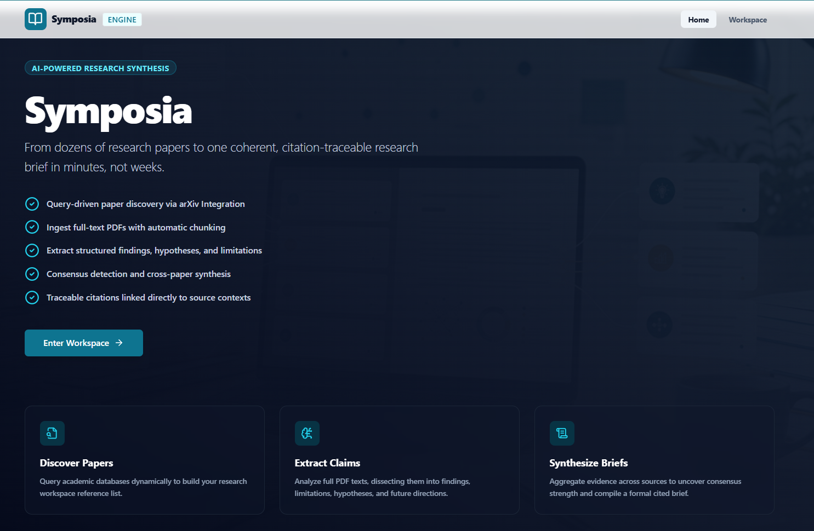
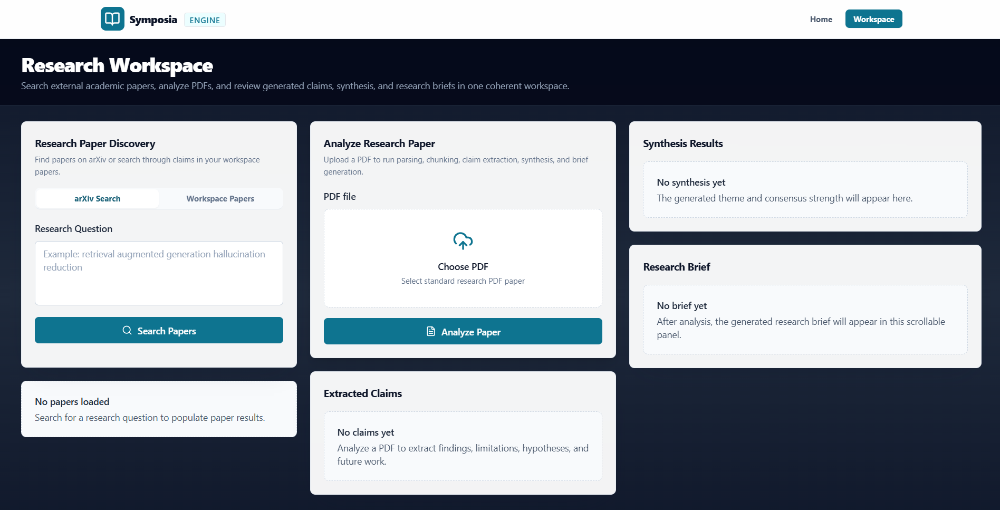

# Symposia — AI Research Synthesis Engine
<div align="center">


### From 50 research papers to one coherent research brief.

An AI-powered platform that discovers research papers, extracts structured claims, indexes them, identifies consensus across sources, and generates research briefs with citation traceability.

</div>

---

## 🚀 Live Demo

*   **Live Web Application**: [symposia-ten.vercel.app](https://symposia-ten.vercel.app/)
*   **Workspace**: [symposia-ten.vercel.app/workspace](https://symposia-ten.vercel.app/workspace)
*   **Production API (Backend)**: [symposia.onrender.com/docs](https://symposia.onrender.com/docs)

> [!NOTE]
> *   **Live Web Application**: Search and discover papers from arXiv, and upload new literature to build your semantic library.
> *   **Workspace**: Access synthesized research briefs, explore structured claims, and run semantic queries across your analyzed documents.

---

## 📸 Screenshots

### Landing Page & Paper Search
Discover relevant papers using natural language queries directly integrated with the arXiv API.


### Workspace Analysis & Synthesis Briefs
Upload files to build your semantic library. Perform vector searches, explore extracted claims, and synthesize cross-paper briefs with consensus scoring and source tracking.


---

# 📖 Table of Contents

*   [🚀 Live Demo](#-live-demo)
*   [📸 Screenshots](#-screenshots)
*   [🎯 Problem Statement](#-problem-statement)
*   [🚀 Project Overview](#-project-overview)
*   [✨ Features](#-features)
*   [🏗️ System Architecture](#-system-architecture)
*   [🛠️ Tech Stack](#-tech-stack)
*   [🔌 API Endpoints](#-api-endpoints)
*   [⚙️ Installation](#-installation)
*   [🔐 Environment Variables](#-environment-variables)
*   [🧪 Testing & Verification](#-testing--verification)
*   [🏆 Assignment Requirements Mapping](#-assignment-requirements-mapping)
*   [📜 License](#-license)

---

# 🎯 Problem Statement

Researchers, students, and professionals face a common challenge: **information overload**. A literature review requires reading dozens of papers, extracting findings, comparing methodologies, identifying consensus, and producing a coherent summary. 

Symposia automates this workflow by:
1. Discovering relevant research papers.
2. Extracting structured claims (findings, limitations, hypotheses, future work).
3. Storing claims in a vector database for semantic indexing.
4. Detecting consensus and conflicts.
5. Generating a structured, cited research brief.

---

# 🚀 Project Overview

Symposia is a production-ready research platform designed to extract actionable insights from academic literature. Users can query arXiv, ingest PDF research papers, search claims across uploaded papers, detect consensus strengths, and export formal briefs.

System goals focus on **correctness, citation traceability, and stable, lightweight deployment** on free-tier services.

---

# ✨ Features

## 📚 Research Paper Discovery
Discover academic literature from arXiv using natural language search queries.
*Example: `"How can RAG reduce hallucinations in LLMs?"`*

## 📄 PDF Ingestion & Chunking
Seamlessly upload PDF documents. PyMuPDF extracts page-by-page text and parses it into semantic chunks, optimizing context windows and retrieval accuracy.

## 🧠 Claim Extraction
Extracts key research claims structured into discrete categories:
*   `finding`
*   `limitation`
*   `hypothesis`
*   `future_work`

## 🔍 Workspace Search
Execute semantic vector queries across your uploaded repository. Retrieve matching claims alongside metadata including source filename and precise page references.

## 🔗 Cross-Paper Synthesis & Consensus
Consolidate extracted claims across multiple papers into high-level themes, evaluating consensus strength (`weak`, `moderate`, `strong`) based on structural alignment and supporting evidence.

## 📝 Citation Traceability
Every synthesis point and claim in the research brief maintains a clear citation trace to its source page and chunk (`[Page X, Chunk Y]`).

---

# 🏗️ System Architecture

```text
Research Query
        ↓
Paper Discovery (arXiv)
        ↓
PDF Upload
        ↓
PDF Parsing (PyMuPDF)
        ↓
Chunking
        ↓
Claim Extraction (Gemini LLM Provider)
        ↓
Batch Embeddings (Gemini Embeddings Provider)
        ↓
Vector Indexing & Search (ChromaDB)
        ↓
Cross-Paper Synthesis
        ↓
Consensus Detection
        ↓
Research Brief Generation (Gemini LLM Provider)
```

---

# 🛠️ Tech Stack

### Frontend
*   **React** (v18.3)
*   **Vite** (v6.0)
*   **Tailwind CSS** (v3.4)
*   **React Query** / **Axios**

### Backend
*   **FastAPI** (Python 3.11+)
*   **Uvicorn**
*   **ChromaDB** (Persistent Local Vector Store)

### AI Stack (Gemini API)
*   **LLM Model**: `gemini-3.1-flash-lite` (via HTTP REST requests, no heavy SDKs)
*   **Embedding Model**: `gemini-embedding-2` (768d / 3072d vector generation)
*   *Note: No SentenceTransformers or heavy PyTorch/HuggingFace model weights are downloaded, keeping the deployment slug lightweight (~15MB instead of 2GB+).*

---

# 🔌 API Endpoints

### `GET /`
Check API server status.

### `GET /health`
Verify server health status.

### `GET /papers/search?query=...`
Search academic papers from arXiv.

### `POST /analyze-paper`
Upload a PDF. Processes PDF pages, extracts claims, embeds them, indexes them in ChromaDB, and returns the claims list, synthesis, and brief.

### `GET /papers/search-library?query=...`
Perform semantic vector search on claims from your uploaded workspace papers. Returns claims with filename and page metadata.

---

# ⚙️ Installation

### Clone Repository
```bash
git clone https://github.com/Spiritsfuse/Symposia.git
cd Symposia
```

### Backend Setup
```bash
cd backend
python -m venv venv
```
Activate virtual environment:
*   Windows: `venv\Scripts\activate`
*   Mac/Linux: `source venv/bin/activate`

Install dependencies:
```bash
pip install -r ../requirements.txt
```

Run server:
```bash
uvicorn main:app --reload
```

### Frontend Setup
```bash
cd ../frontend
npm install
npm run dev
```

Open `http://localhost:5173` in your browser.

---

# 🔐 Environment Variables

Create a `backend/.env` file:
```env
GEMINI_API_KEY=your_gemini_api_key_here
GEMINI_LLM_MODEL=gemini-3.1-flash-lite
GEMINI_EMBEDDING_MODEL=gemini-embedding-2
ENV=development
```


---

# 🧪 Testing & Verification

Automated test scripts are provided in the `backend/` directory to verify individual modules and the end-to-end processing pipeline.

Make sure you are in the `backend` directory with your virtual environment active before running:

*   **Embeddings Verification**: `python test_embedding.py`
*   **Synthesis Verification**: `python test_synthesis.py`
*   **Brief Generation Verification**: `python test_brief.py`
*   **Vector Store Integration**: `python test_vector_store.py`
*   **End-to-End Pipeline**: `python test_integration.py`

---

# 🏆 Project Feature Coverage

| Requirement | Status | Implementation |
| :--- | :--- | :--- |
| **Paper Discovery** | ✅ **Complete** | Search arXiv using queries; returns structured metadata. |
| **Document Ingestion** | ✅ **Complete** | Full PDF upload, text extraction, page parsing, and chunking. |
| **Claim Extraction** | ✅ **Complete** | Extracts findings, limitations, hypotheses, and future work. |
| **Cross-Paper Synthesis** | ✅ **Complete** | Groups claims across source papers into semantic themes. |
| **Consensus Detection** | ✅ **Complete** | Computes consensus strength (strong, moderate, weak) based on support. |
| **Research Brief Generation** | ✅ **Complete** | Compiles structured Markdown briefs containing Exec Summary, Themes, Gaps. |
| **Citation Traceability** | ✅ **Complete** | Traces all generated findings back to `[Page X, Chunk Y]`. |
| **Export Support** | ✅ **Complete** | Copy-to-clipboard, raw Markdown download, and citation support. |

---

# 📜 License

This project is licensed under the MIT License.
